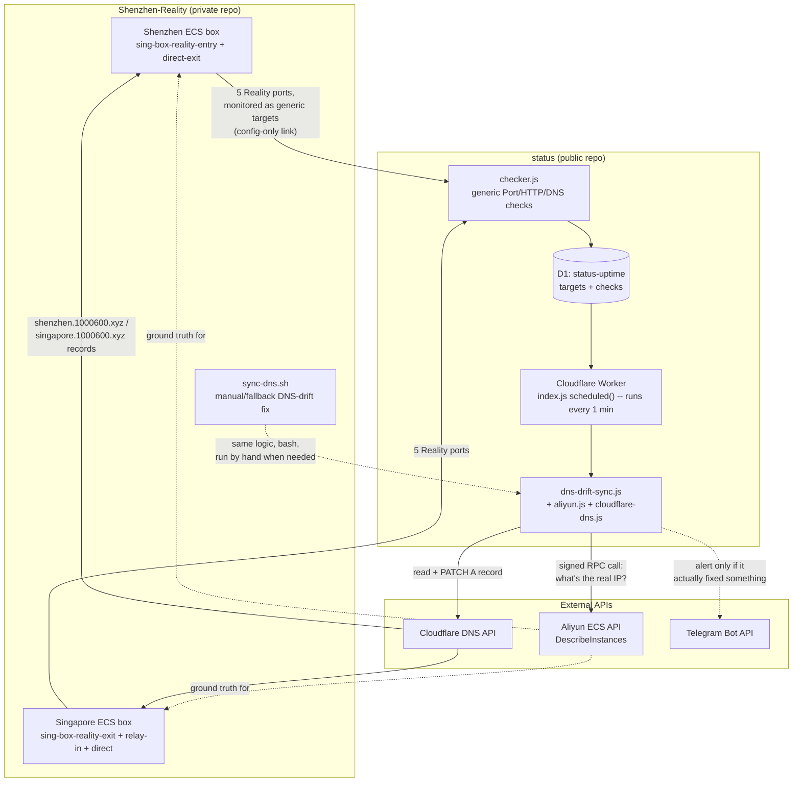
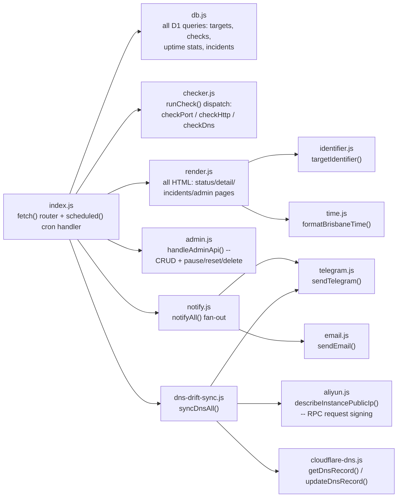
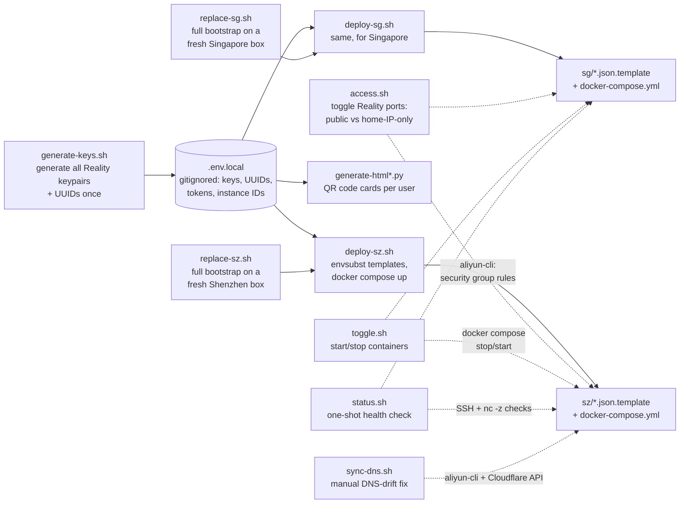

# Architecture: how `status` and `Shenzhen-Reality` relate

This file exists so that coming back to either repo cold (a year from now, say) doesn't require re-deriving how the pieces fit together. Same content lives in both `zzpy20/status` and `zzpy20/Shenzhen-Reality` so whichever repo you open first has the full picture.

**One-paragraph version:** `Shenzhen-Reality` is the actual proxy (two Aliyun ECS boxes running VLESS+Reality). `status` is a separate, generic Cloudflare Worker uptime monitor that happens to (a) watch Shenzhen-Reality's 5 proxy ports as one of its monitored targets, a config-only relationship, and (b) also run a bolted-on module that keeps Shenzhen-Reality's DNS records correct, a real code-level dependency. The two repos don't share any code or npm packages — everything is duplicated deliberately (small independent scripts/Workers, no shared library, matching how every other tool in this workspace is built).

## Cross-repo relationship

**Why `dns-drift-sync.js` lives inside `status` instead of its own Worker:** a dedicated `dns-sync` Worker was built and fully worked (Aliyun request-signing from scratch, verified against the real API), but Cloudflare's free plan caps an account at 5 cron triggers total, and this account was already at that limit across other unrelated projects (`cloud-mail`, `mailmind`, `plos-calendar-alert-api`). Rather than pay for Workers Paid or disable a trigger on a live unrelated product, the logic was merged into `status`'s existing 1-minute cron and the standalone Worker was deleted. If `status` is ever forked for a different project (its original design intent — see its own README), `dns-drift-sync.js` + `aliyun.js` + `cloudflare-dns.js` and their 3 extra secrets/6 extra vars are the one non-generic part; safe to delete along with the one-line call to `syncDnsAll()` in `index.js`.

**Why `sync-dns.sh` still exists even though the fix is automated:** it's the manual/on-demand fallback — same drift-detection logic, hand-run via SSH+aliyun-cli+curl instead of waiting for the next cron tick. Kept deliberately, not dead code.

## `status` module map

- **`index.js`** — the only file with both Workers entry points. `fetch()` routes `/`, `/monitor/:id`, `/incidents`, `/admin`, `/admin/api/*`, `/api/status`. `scheduled()` fires both `runChecks()` (generic monitoring) and `syncDnsAll()` (the Shenzhen-Reality-specific bolt-on) on every 1-minute tick.
- **`db.js`** — every SQL query against the `status-uptime` D1 database lives here; nothing else touches D1 directly.
- **`checker.js`** — the 3 monitor types (Port/HTTP/DNS), each returning `{isUp, latencyMs, reason}`; `reason` is the root-cause string surfaced on the Incidents page.
- **`render.js`** — the biggest file; every page is a JS template-literal string (HTML + inline `<script>` client-side JS), no framework.
- **`admin.js`** — the token-gated write API behind `/admin/api/*`.
- **`notify.js` / `telegram.js` / `email.js`** — state-change push notifications (up↔down), Telegram + Resend email in parallel, independent failure.
- **`dns-drift-sync.js` / `aliyun.js` / `cloudflare-dns.js`** — the Shenzhen-Reality bolt-on described above. `aliyun.js` is the only file in this whole workspace implementing Aliyun's RPC Signature Version 1.0 (HMAC-SHA1 over a canonicalized, percent-encoded query string) — if it ever needs touching again, that's genuinely unusual/fiddly code, re-verify against a real API call before trusting changes.

## `Shenzhen-Reality` file map

- **`generate-keys.sh`** — run once; produces every Reality keypair + short_id + user UUID, written to `.env.local`. Never re-run against a live deployment without meaning to (rotates every key).
- **`deploy-sz.sh` / `deploy-sg.sh`** — the actual deploy step: `envsubst` the `.json.template` files using `.env.local`, then `docker compose up -d --force-recreate`. Meant to be run *on* each box, not from the Mac.
- **`replace-sz.sh` / `replace-sg.sh`** — full disaster-recovery bootstrap for a brand-new box: installs Docker, transfers the repo, reuses existing keys from `.env.local`, calls the corresponding `deploy-*.sh`, generates fresh QR cards. Hardened over several real replications against mainland-China-specific connectivity failures (ghcr.io pulls, bulk scp, `get.docker.com` fetches) — see README for the "why built this way" history before changing the fetch strategy.
- **`sz/` / `sg/`** — per-box sing-box config templates (3 circuits: forward/China-bypass, reverse/China-access, direct) and each box's `docker-compose.yml`.
- **`access.sh`** — the only thing that changes *who* can reach the proxy ports (Aliyun security group rules), independent of whether the containers are even running.
- **`toggle.sh`** — the only thing that stops/starts the containers themselves, independent of firewall rules.
- **`status.sh`** — read-only health check (instance state, containers, port reachability); the go-to first step when something seems wrong.
- **`sync-dns.sh`** — manual fallback for the same DNS-drift problem `status`'s `dns-drift-sync.js` now fixes automatically every minute.
